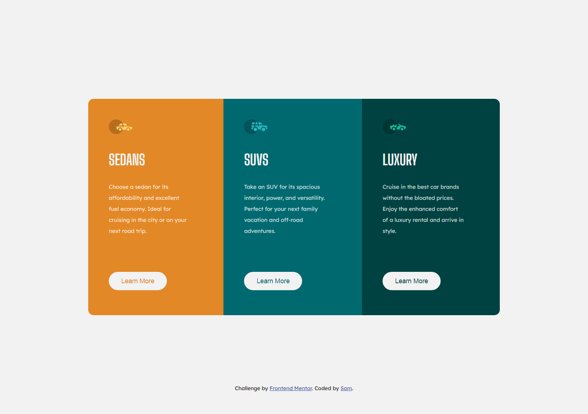

# Frontend Mentor - 3-column preview card component solution

This is a solution to the [3-column preview card component challenge on Frontend Mentor](https://www.frontendmentor.io/challenges/3column-preview-card-component-pH92eAR2-). Frontend Mentor challenges help you improve your coding skills by building realistic projects.

## Table of contents

- [Overview](#overview)
  - [The challenge](#the-challenge)
  - [Screenshot](#screenshot)
  - [Links](#links)
- [My process](#my-process)
  - [Built with](#built-with)
- [Author](#author)

## Overview

### The challenge

Users should be able to:

- View the optimal layout depending on their device's screen size
- See hover states for interactive elements

### Screenshot

### Links

- Solution URL: https://www.frontendmentor.io/solutions/3column-preview-card-using-scss-Q2nxUjvvN
- Live Site URL: https://sam4web.github.io/3-column_preview_card/

## My process

### Built with

- Semantic HTML5 markup
- SCSS custom properties
- Flexbox

## Author

- Frontend Mentor - [@sam4web](https://www.frontendmentor.io/profile/sam4web)
- Github - [sam4web](https://github.com/sam4web)
